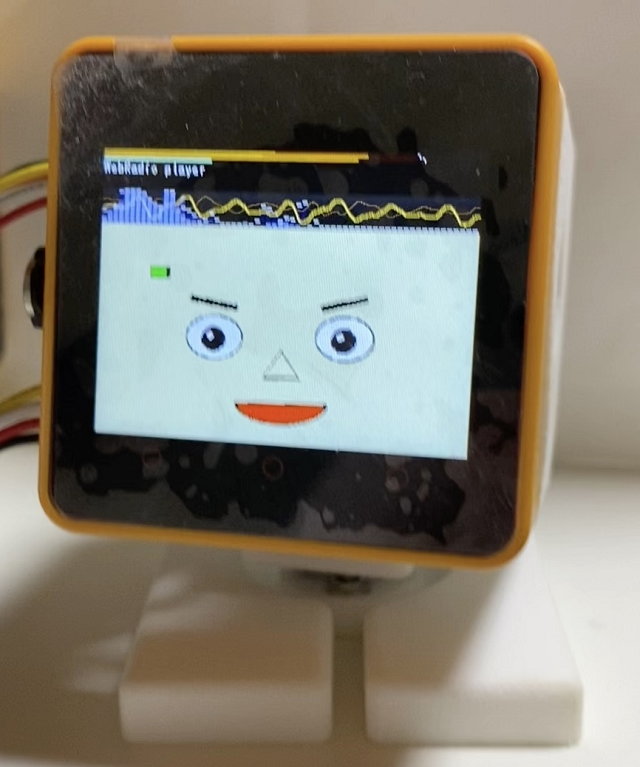

# M5Unified_StackChan_Radiko
WebRadio Radikoプレイヤー付きｽﾀｯｸﾁｬﾝです。

  

@mongonta555 さんの[ｽﾀｯｸﾁｬﾝ M5GoBottom版組み立てキット](https://raspberrypi.mongonta.com/about-products-stackchan-m5gobottom-version/ "Title")に対応しています。 

wakwak-kobaさんの M5Stack Radikoプレイヤーをアバターとレベルメーターを同時に表示できるように改造。 
さらにｽﾀｯｸﾁｬﾝM5GoBottom版組み立てキットで動くようにしました。 

Radikoプレイヤーは、wakwak-kobaさんのWebRadio_Japanをベースにさせていただきました。 
オリジナルはこちら。 
WebRadio_Japan <https://github.com/wakwak-koba/WebRadio_Japan> 

Avatar表示は、meganetaaanさんのm5stack-avatarをベースにさせていただきました。 
オリジナルはこちら。 
An M5Stack library for rendering avatar faces <https://github.com/meganetaaan/m5stack-avator> 

---
### このプログラムを動かすのに必要な物 ###
* [M5Stack Core2](http://www.m5stack.com/ "Title") (M5Stack Core2 for AWSで動作確認をしました。) 
[ｽﾀｯｸﾁｬﾝ M5GoBottom版組み立てキット](https://raspberrypi.mongonta.com/about-products-stackchan-m5gobottom-version/ "Title")
* VSCode
* PlatformIO 

使用しているライブラリ等は"platformio.ini"を参照してください。 

---
### ｽﾀｯｸﾁｬﾝを組み立てる時の注意点 ###
ｽﾀｯｸﾁｬﾝ を組み立てる時は事前にサーボの位置を90度にしておいて、その時ｽﾀｯｸﾁｬﾝが正面を向くように取り付けてください。 
それを忘れるとバラしてもう一度組み立て直しになる可能性があります。 

---
### サーボモーターで使用するピンの設定 ###
* "M5Unified_StackChan_Radiko.ino"の10行目付近、SERVO_PIN_XとSERVO_PIN_Yを設定してください。

---
### WiFiの設定 ###
* "M5StickC_WebRadio_Radiko_Avatar.ino"の1行目付近、SSIDとPASSWORDを設定してください。
* SSIDとPASSWORDを設定せずにSmartConfigを使用することもできます。
その場合はiOSかAndroidの「Espressif Esptouch」アプリから設定します。

---
### 使い方 ###
* Wi-Fiの設定はSmartConfigを使用し、iOSかAndroidの「Espressif Esptouch」アプリから設定します。 
* ボタンA：選曲 ボタンB：音量ー ボタンC：音量＋ 
* レベルメーター表示部にタッチすると、レベルメーター表示をON/OFFできます。 
* 画面中央にタッチすると首振りを止めます。  

---
### 参考リンク ###
* [ｽﾀｯｸﾁｬﾝ M5GoBottom版 組み立て方法【その１ 部品キット編】](https://raspberrypi.mongonta.com/how-to-make-stackchan-m5gobottom/ "Title")　 
* [ｽﾀｯｸﾁｬﾝ M5GoBottom版 組み立て方法【その2 ケースセットの組み立てと完成まで】](https://raspberrypi.mongonta.com/how-to-make-stackchan-m5gobottom-2/ "Title")　 
* [分解作業なしでｽﾀｯｸﾁｬﾝを作る。【ｽﾀｯｸﾁｬﾝ M5GoBottom版 組み立てキット】](https://raspberrypi.mongonta.com/how-to-build-easy-stackchan-m5gobottom/ "Title") 

   

